# VPC Basics Lab

## 1. Get Started Using the Lab Environment 

If you are attending a formal AWS event, you will have been sent a 12-character access code (or ‘hash’) that grants you permission to use a dedicated AWS account for this workshop. If you are using your own AWS account, please proceed to the next section.

**Step 1 :** Go to https://dashboard.eventengine.run/, enter the access code and click Proceed: 

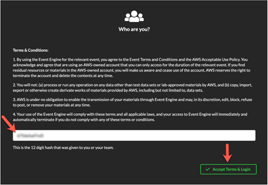

**Step 2 :**   Click on **AWS Console**, then **Open AWS Console** to login into your dedicated AWS environment.

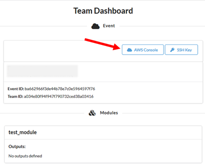     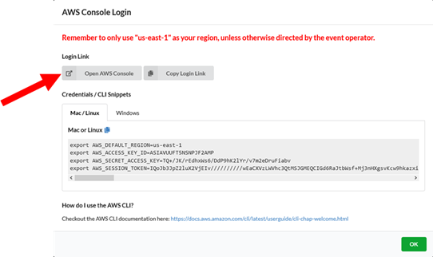

 


 

# 2.  Create VPC, IGW, NatGW and EC2 instances 

Amazon Virtual Private Cloud (Amazon VPC) lets you provision a logically isolated section of the AWS Cloud where you can launch AWS resources in a virtual network that you define. You have complete control over your virtual networking environment, including selection of your own IP address range, creation of subnets, and configuration of route tables and network gateways. You can use both IPv4 and IPv6 in your VPC for secure and easy access to resources and applications.

 

An internet gateway (IGW) is a horizontally scaled, redundant, and highly available VPC component that allows communication between instances in your VPC and the internet. It therefore imposes no availability risks or bandwidth constraints on your network traffic.

 

In this lab, we will create one VPC with one public subnet and one private subnet for 2 availability zones, with an instance in each subnet. And we will deploy a IGW and NatGWs to provide network to the instances.

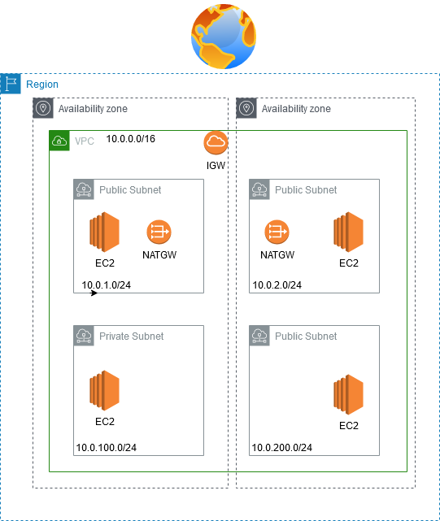


 

## 2.1   Navigate to VPC Dashboard 

To get started, navigate to VPC Dashboard Services:

**Step 3 :** https://console.aws.amazon.com/vpc/home?region=eu-west-3#vpcs:

 

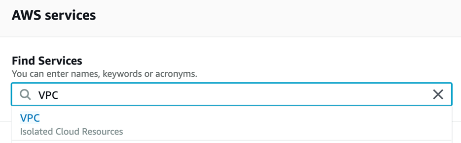

 

In every region, a default VPC has already been created for you. So, even if you haven’t created anything in your account yet, you will see some VPC resources already there. But, here, we are going to create the VPC from scratch.

 

## 2.2   Create VPC with subnets and EC2 instances

In this lab, we will be creating one VPC with one private subnet and one public subnet. Each VPC will have subnets in two Availability Zones within the Region. We will deploy one EC2 instance per VPC and demonstrate that, by default, VPCs provide network isolation. 

 

Table 1. IPv4 CIDR allocations for VPCs and AZs.

| **VPC Name** | **VPC    CIDR block** | **Availability Zone** | Subnet  |               |
| ------------ | --------------------- | --------------------- | ------- | ------------- |
| **VPC A**    | 10.0.0.0/16           | eu-west-3a            | public  | 10.0.1.0/24   |
|              |                       | eu-west-3a            | private | 10.0.100.0/24 |
|              |                       | eu-west-3b            | public  | 10.0.2.0/24   |
|              |                       | eu-west-3b            | private | 10.0.200.0/24 |

 

 

### 2.2.1  Create VPC

Our first step is to create the VPC with the CIDR 10.0.0.0/16

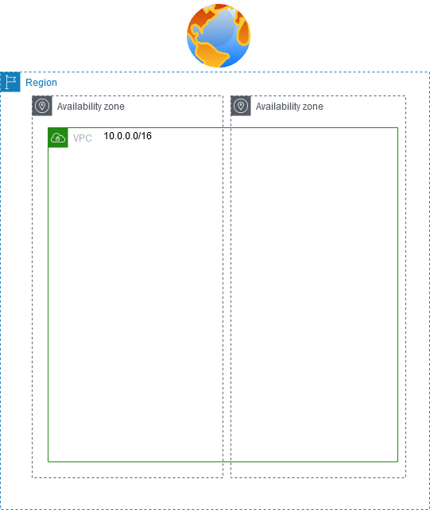

**Step 4 :** Navigate to “Your VPCs” tab and click “Create VPCs” button. 

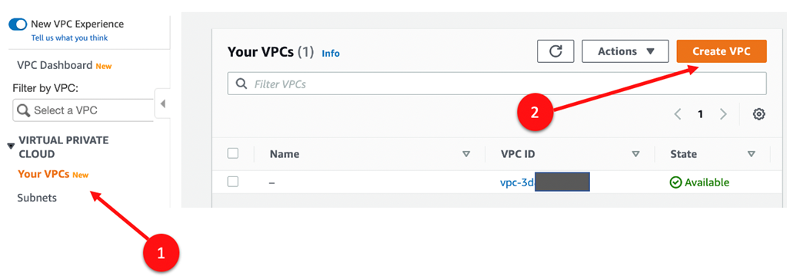

 

·   **Step 5 :** Create “MyVPC”, specifying 10.0.0.0/16 as IPv4 CIDR block. Do not enable IPv6. Select “Default” Tenancy. Accept proposed Tags:

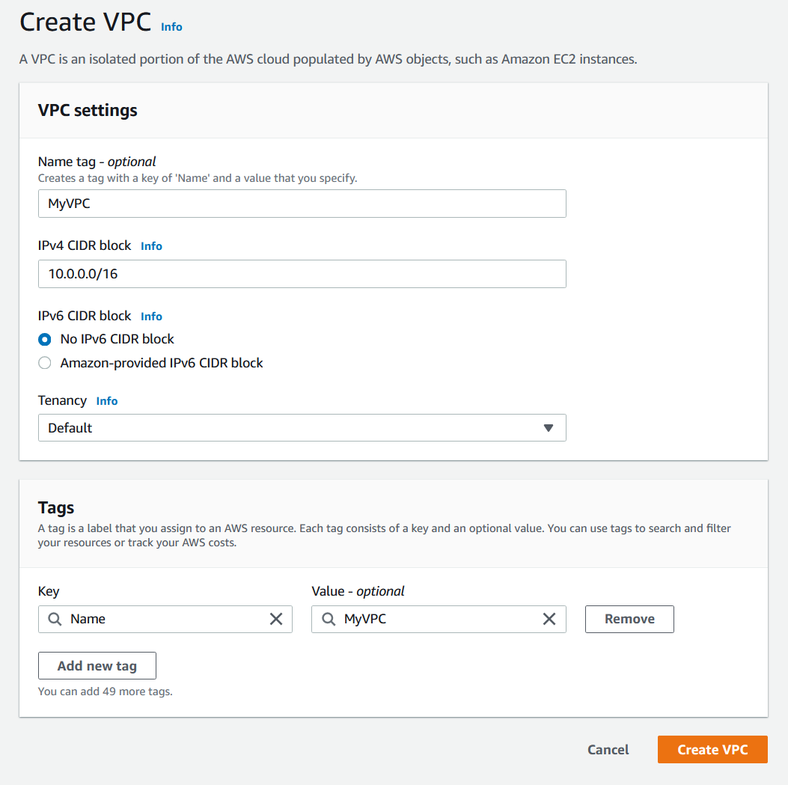

**Step 6 :**After completing these steps, you should have one new VPC and default listed under “Your VPCs:”

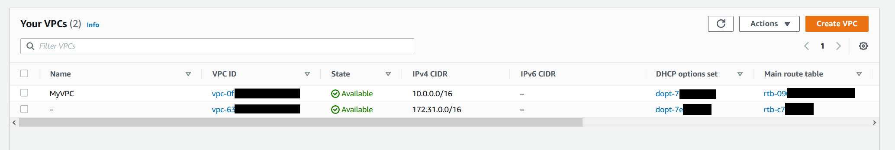

 

### 2.2.2  Create Subnets

For our VPC, we will create 4 subnets in total, two subnets per availability zone – one public subnet and one private subnet for each AZ. 

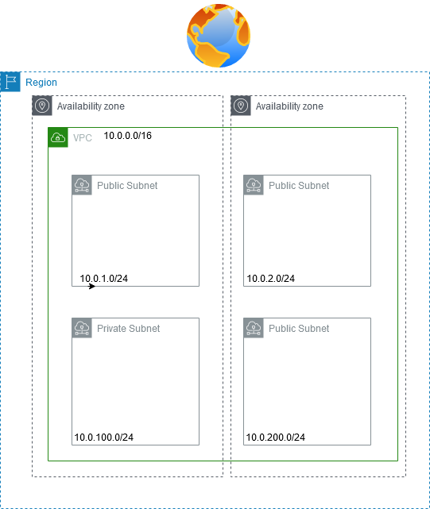

Figure 2. Allocating Subnets to AZs. 

**Step 7 :** Navigate to “Subnets” panel: 

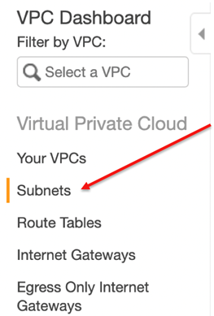

 

**Step 8 :** Click on “Create subnet” button, create subnets with names that reflect private or public position and AZ placement, such as “AZa-PublicSubnet”:

 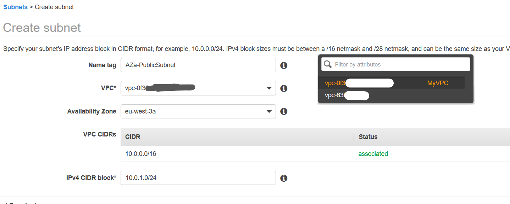

Table 1. IPv4 CIDR allocations for VPCs and AZs.

| **VPC Name** | **VPC    CIDR block** | **Availability Zone** | Subnet  | Subnet        | Name              |
| ------------ | --------------------- | --------------------- | ------- | ------------- | ----------------- |
| **VPC A**    | 10.0.0.0/16           | eu-west-3a            | public  | 10.0.1.0/24   | AZa-PublicSubnet  |
|              |                       | eu-west-3a            | private | 10.0.100.0/24 | AZa-PrivateSubnet |
|              |                       | eu-west-3b            | public  | 10.0.2.0/24   | AZb-PublicSubnet  |
|              |                       | eu-west-3b            | private | 10.0.200.0/24 | AZb-PrivateSubnet |


**Step 9 :** On your own, create the 3 additional subnets ; refer to Table 1 for CIDR allocations. 

After you finish the task, 4 new subnets should be available (in red):

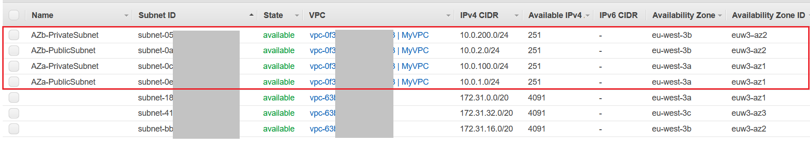

 

### 2.2.3  Deploy Internet Gateways 

In this section, we will deploy one Internet Gateway (IGW) in the VPC. We need an Internet Gateway in order to establish outside connectivity to EC2 instances in VPCs. 

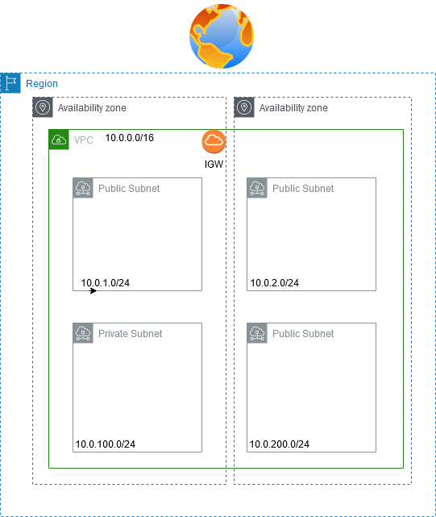

**Step 10 :** Navigate to “Internet Gateways” and click on “Create internet gateway”

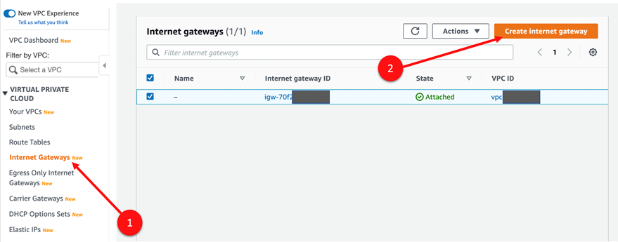

 

**Step 11 :** Select Internet Gateway for “MyVPC”, such as “MyVPC - IGW”.      Click “Create”

  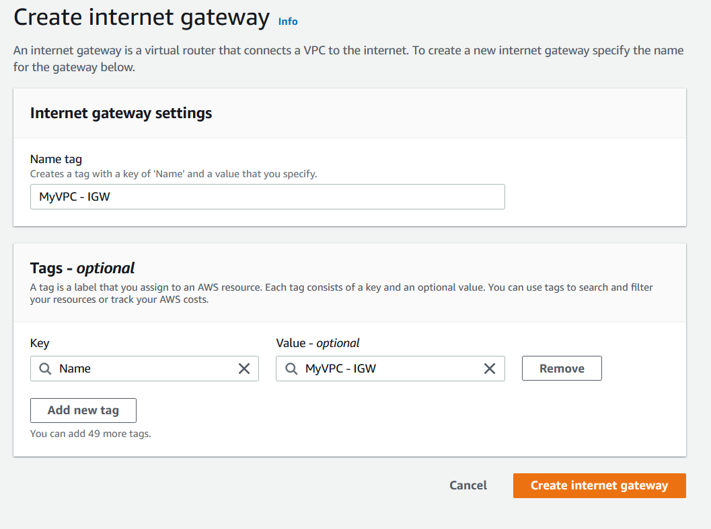

**Step 12 :** Select newly created IGW and click on “Attach to VPC”:

 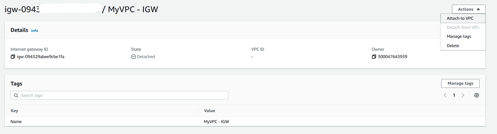

**Step 13 :** Attach this IGW to “MyVPC:” 

 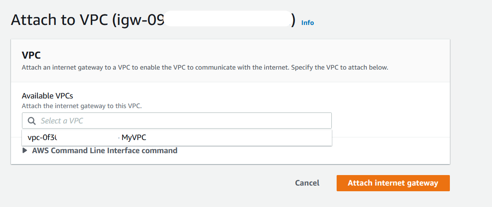

**Step 14 :** You should now have an IGW for the default VPC and one newly created IGW with the "MyVPC" available:

 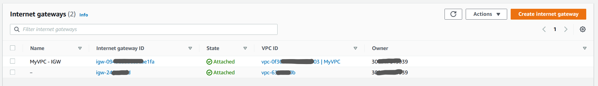

### 2.2.3  Deploy Nat Gateways  

In this section, we will deploy 2 Nat gateways in the VPC. One for each AZ, because the Nat Gateway is not a regional service, but an AZ service. If one AZ failed, the nat gateway in this AZ will failed, and will not provided the service for other AZ. 

We need a Nat Gateway in order to establish outside connectivity to EC2 instances in private subnets. 

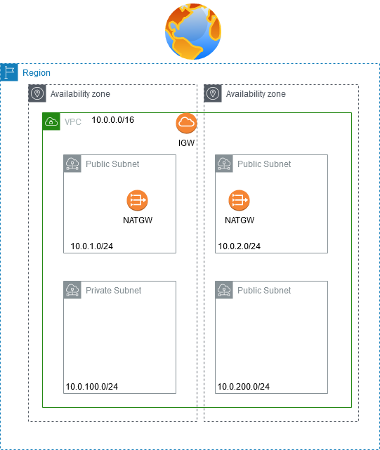

**Step 15 :** Go to "Nat Gateways" in the Virtual Private Cloud console

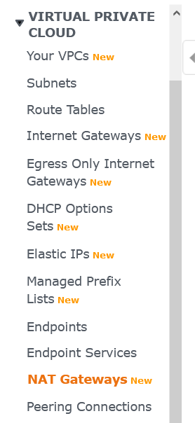


**Step 16 :** Click on "Create a NAT Gateway". We are going to create the NAT Gateway for the AZa

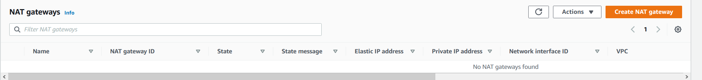

**Step 17 :** Define a name "MyNatGateway-AZa" and select the public Subnet of your VPC in the AZa

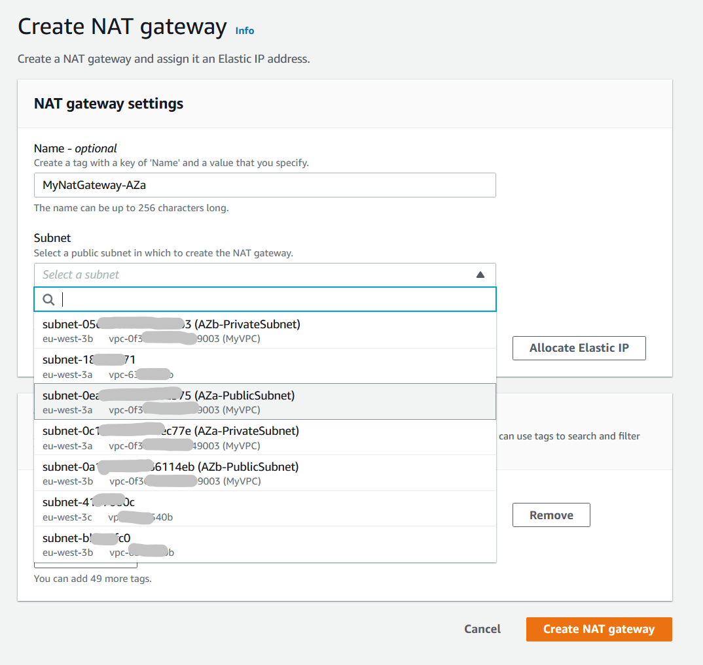

**Step 18 :** And then you need to allocate an EIP to this NAT Gateway.

 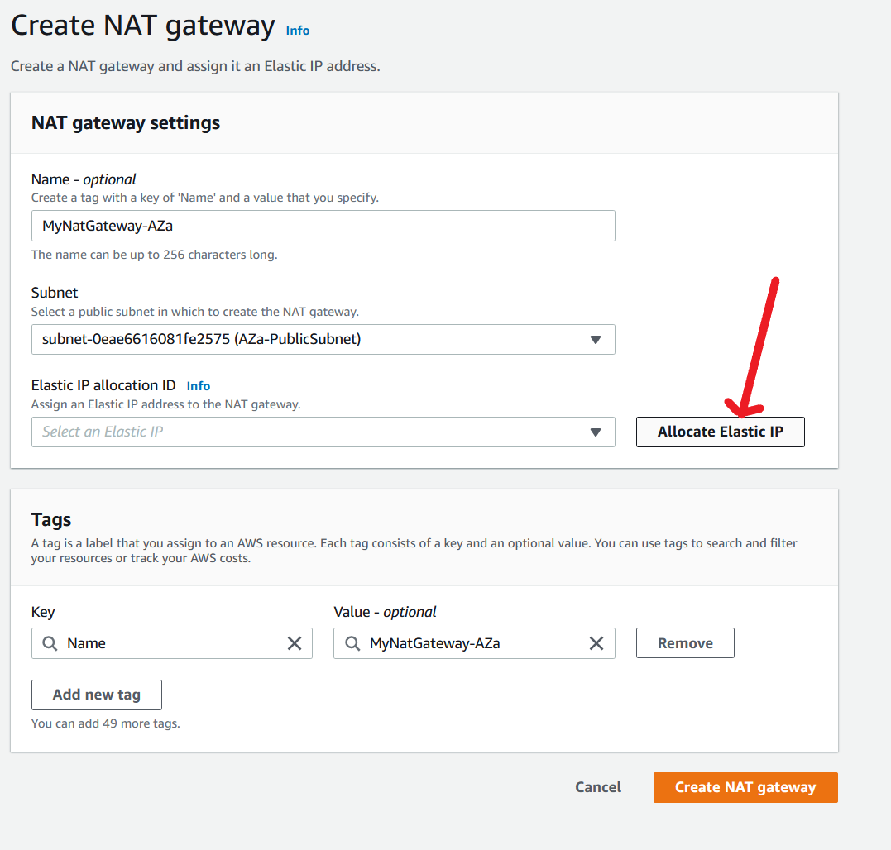

**Step 19 :**  And then you can "create NAT Gateway"

Now you should create by your own the second NAT Gateway for AZb, in the public Subnet in the AZb.

**Step 20 :**  At the end you should have 2 NAT Gateways. They will stay in pending state during a few minutes, and then transition to Available state.

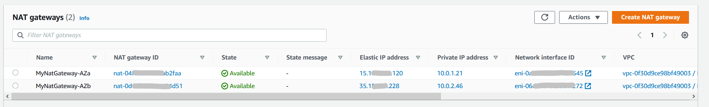


### 2.2.4  Update Routing Tables 

In order to use newly created Internet Gateway and NAT Gateways, you need to have 3 different route tables :

- One route table with default route to Internet Gateway for the 2 public subnets.
- Two route tables, one route table per each private subnet, with a default route to the NAT gateway hosted in the same AZ.

| Route Table            | Subnet Association                | EC2  instance Public IP Address |
| ---------------------- | --------------------------------- | ------------------------------- |
| MyRouteTablePublic     | AZa-PublicSubnet,AZb-PublicSubnet | X.X.X.X                         |
| MyRouteTablePrivateAZa | AZa-PrivateSubnet                 |                                 |
| MyRouteTablePrivateAZb | AZb-PrivateSubnet                 | X.X.X.X                         |

**Step 21 :**  In VPC Dashboard, navigate to “Route Tables:”

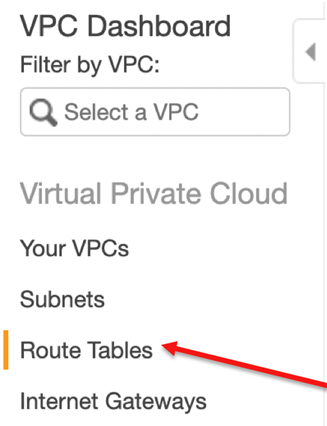

 

#### Public Route table

**Step 22 :** So we will use the main route of our VPC for the public subnet. Just to track this route for the future, assign Names to the Route Tables by identifying what VPC a given Route Table belongs to:

 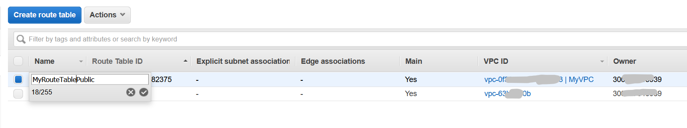

**Step 23 :** So we will modify the route. You just need to select the tab "route" in the below of the screen, and then "Edit Routes"

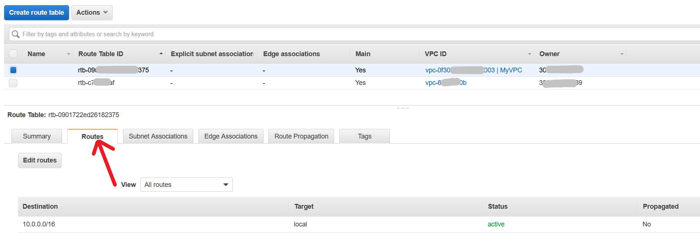

 **Step 24 :** Add the default route 0.0.0.0/0 to your Internet Gateway

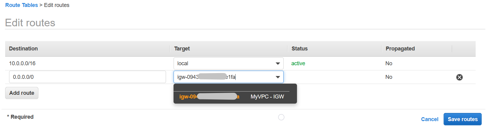

**Step 25 :** "Save route". And we need now to associate the route table to the 2 public subnets.

**Step 26 :** Move to the below tab "Subnet Associations", then "Edit subnet associations".

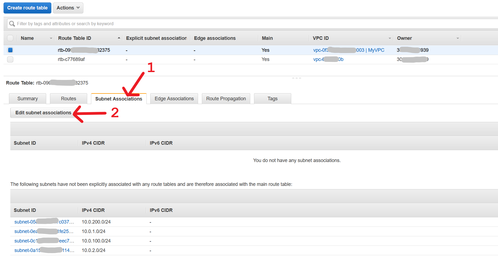

**Step 27 :** Add the 2 public subnet and save

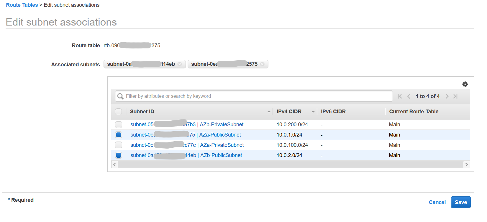

#### Private Route table

 **Step 28 :** Now, you need to recreate 2 new routes, with default route to the NAT Gateway of the same AZ, so : 

- create a new Route table and Name it “MyRouteTablePrivateAZa” with default route to the NAT Gateway of the AZa
- create a new Route table and Name it “MyRouteTablePrivateAZb” with default route to the NAT Gateway of the AZb

 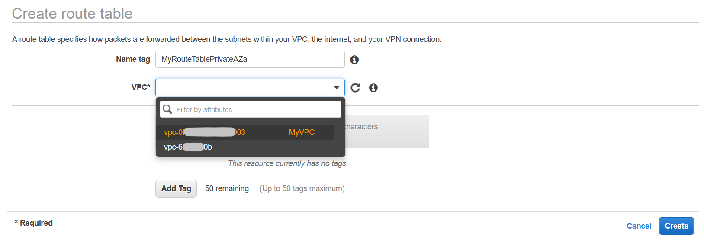

**Step 29 :** Add the default route 0.0.0.0/0 to the NAT Gateway AZa

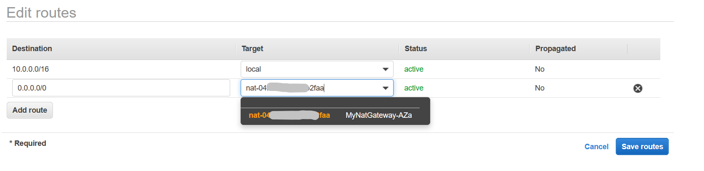

**Step 30 :** Associate to the private subnet AZa.

**Step 31 :** Repeat the steps to create and configure the second Private Subnet's route table. At the end, you should have 3 route tables.

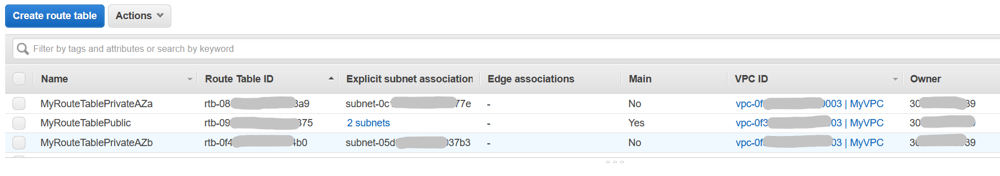

### 2.2.5  Deploy EC2 instances in each subnets.  


#### 2.2.5.2 Session Manager IAM Role 

We need to create an IAM role to have access to the instances

**Step 32 :** https://console.aws.amazon.com/iam/home?region=eu-west-3#/roles

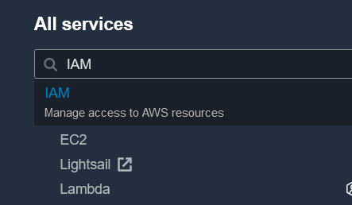

**Step 33 :** Then move to "Role" 

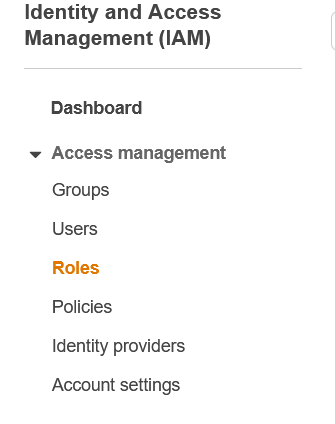

**Step 34 :** "Create Role"

**Step 35 :** Select "AWS Service", select "EC2" and then "Next: Permissions"

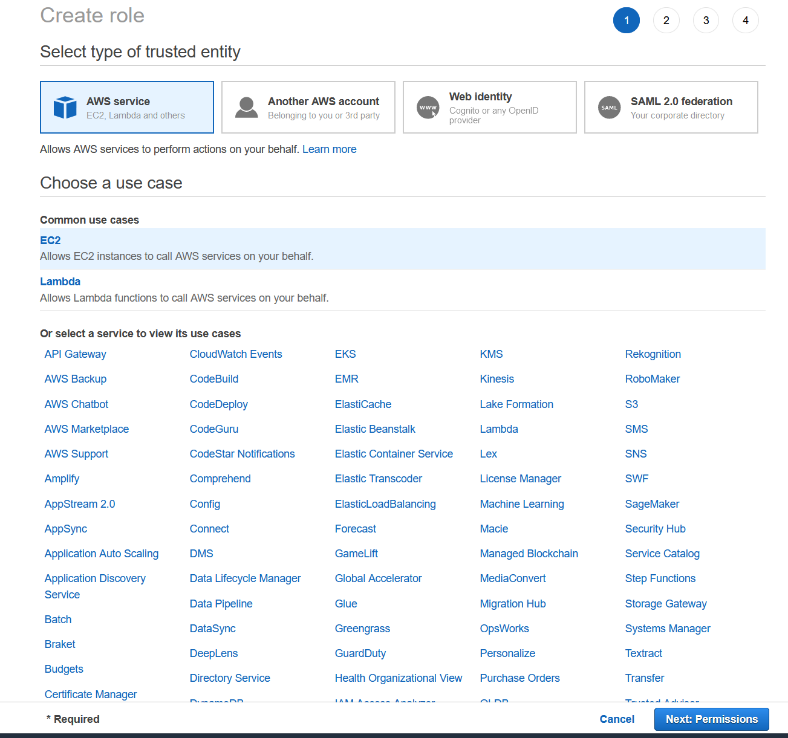

**Step 36 :** In the "filter policies" search for "AmazonSSMManagedInstanceCore", select it in the below list. And click sur "Next: Tag", click sur "Next : Review"

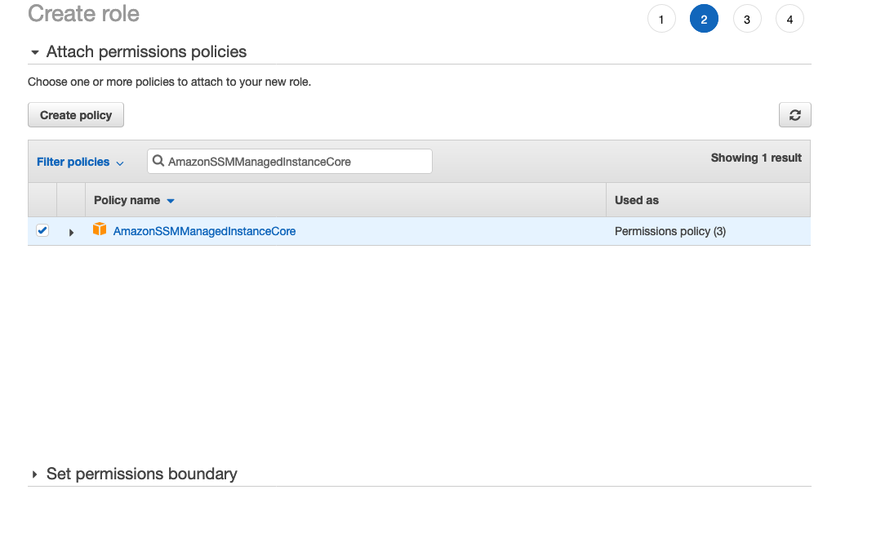

**Step 37 :** And finally, in the review attribute a name to the policy "SSMImmersionRole", and then create.


#### 2.2.5.2 Launch EC2 Instances 


**Step 38 :** https://eu-west-3.console.aws.amazon.com/ec2/v2/home?region=eu-west-3#Home:

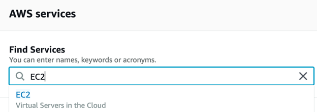

**Step 39 :** Click on “Launch Instances”. 


**Step 40 :** Give a name to the future instance base. As we will launch 4 instances, use the names in the table below and follow the properties for the networking step.

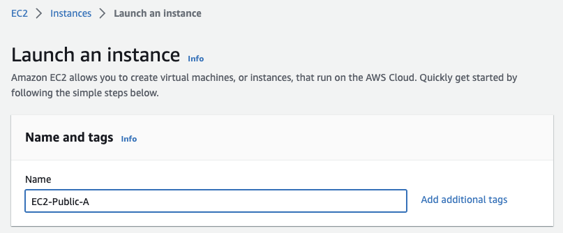

| Name             | Subnet Association                | Enable public IP Address |
| ---------------------- | --------------------------------- | ------------------------------- |
| EC2-Public-ZoneA |AZa-PublicSubnet  |    Enable                      |
| EC2-Public-ZoneB |AZb-PublicSubnet  |    Enable                      |
| EC2-Private-ZoneA |AZa-PrivateSubnet  |    Disable                      |
| EC2-Private-ZoneB |AZb-PrivateSubnet  |    Disable                      |

**Step 41 :** Choose “Amazon Linux 2 AMI (HVM) - Kernel 5.10, SSD Volume Type” 64-bit x86. 

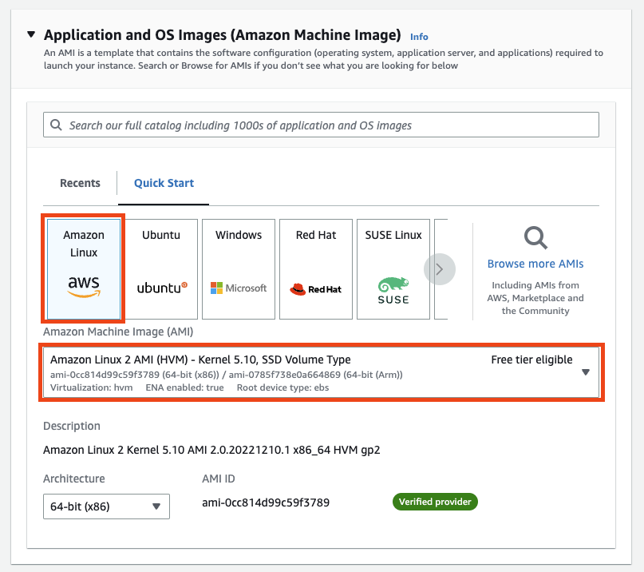

**Step 42 :**  We will use Free tier eligible `t2.micro`. Then select `Proceed without a key pair (Not recommended)` as we will use SSM to connect to the instances.

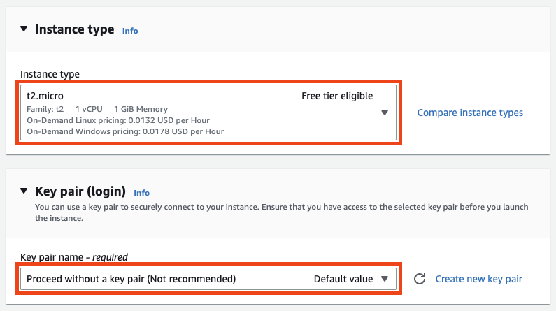

 **Step 43:** In the `Network settings` panel, click on the `Edit` button.

 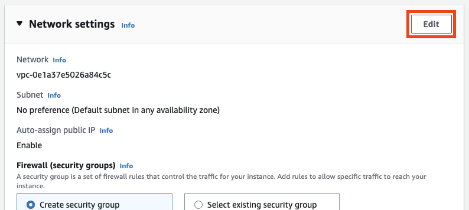

 **Step 44:** Select the VPC that we have just created, the subnet for the instance that we are creating and if we want to assign a public IP (cf table above).

 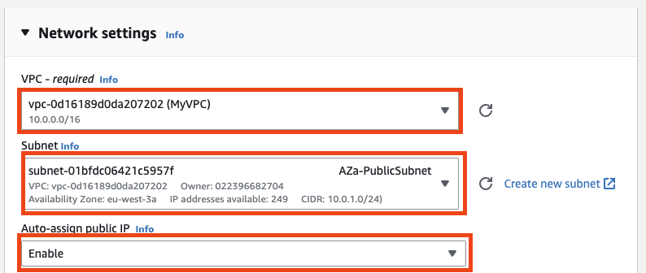

 **Step 45:** Only for the first EC2 instance, you will create a new security group that will open 3 ports to the world. On the following instances, you can simply use `Select existing security group` and select the security group named `ID-allow-too-much`

 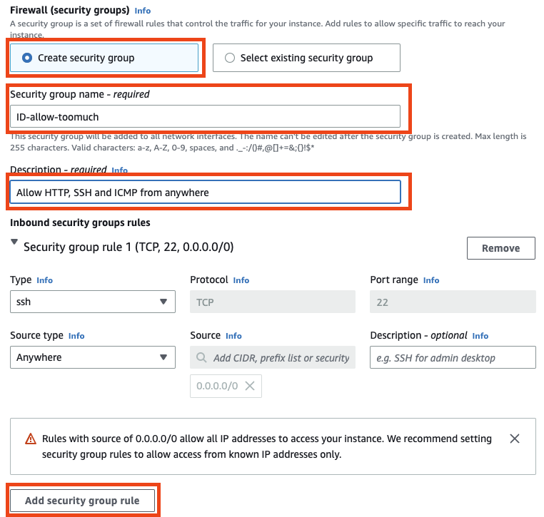

**Step 46:** Add two other rules by clicking on `Add security group rule`

 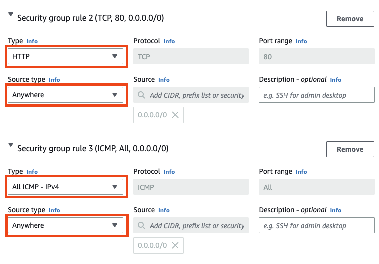

**Step 47:** Unfold the `Advanced detail` panel and select `SSMImmersionRole` for the `IAM Instance profile` option.

 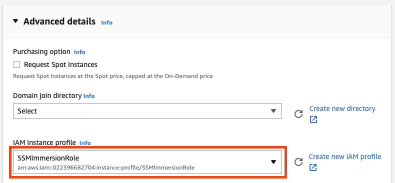 

**Step 48:** At the end of the details section, insert the following in the user data box:
```
#include https://s3.amazonaws.com/immersionday-labs/bootstrap.sh
```
and finally click on `Launch instance`

 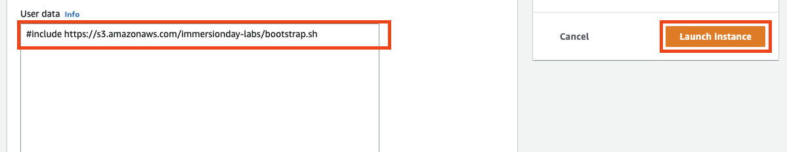

 

 **Step 50 :** Launch 3 more EC2 instances with the properties from the table here :

 | Name             | Subnet Association                | Enable public IP Address |
| ---------------------- | --------------------------------- | ------------------------------- |
| EC2-Public-ZoneB |AZb-PublicSubnet  |    Enable                      |
| EC2-Private-ZoneA |AZa-PrivateSubnet  |    Disable                      |
| EC2-Private-ZoneB |AZb-PrivateSubnet  |    Disable                      |

 

 **Step 51 :** After few minutes, you should have 4 EC2 instances in the “running” state. 

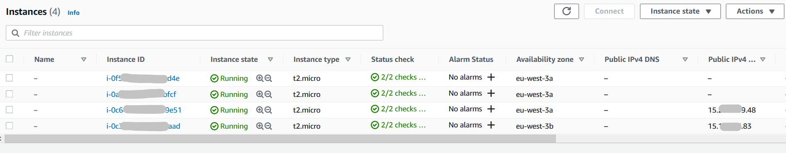

 

 

 **Step 52 :** Write down the private IPv4 addresses assigned to EC2 instances by clicking on an Instance and navigating to the Networking tab:

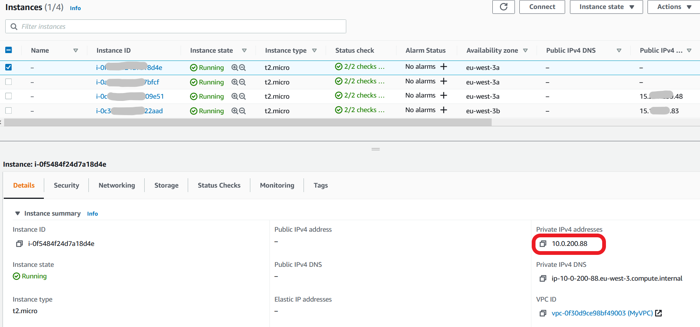

 

 **Step 53 :** Populate the following table with IP information. 

Table 2. EC2 instances' private IP Addresses

| Subnet             | **EC2  instance Private IP Address** | EC2  instance Public IP Address |
| ------------------ | ------------------------------------ | ------------------------------- |
| Public Subnet AZa  | 10.0.1.[………]                         | X.X.X.X                         |
| Private Subnet AZa | 10.0.100.[………]                       |                                 |
| Public Subnet AZb  | 10.0.2.[………]                         | X.X.X.X                         |
| PrivateSubnet AZb  | 10.0.200.[………]                       |                                 |

 

# 3  Connectivity test 

### 3.1 How to access to the instances

To have access to your EC2 instances, you are going to use AWS System Manager, and especially Session Manager. But, it already available in the EC2 instance page.

 **Step 54 :** https://eu-west-3.console.aws.amazon.com/ec2/v2/home?region=eu-west-3#Instances:

 **Step 55 :** In the EC2 Page, you just have to select the instance, and click on "Connect"

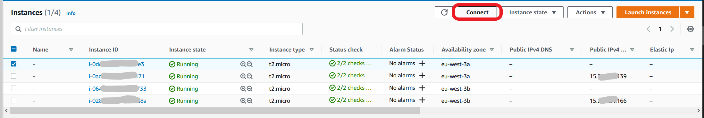

 **Step 56 :** Select "Session Manager" tab, and the click on "Connect"

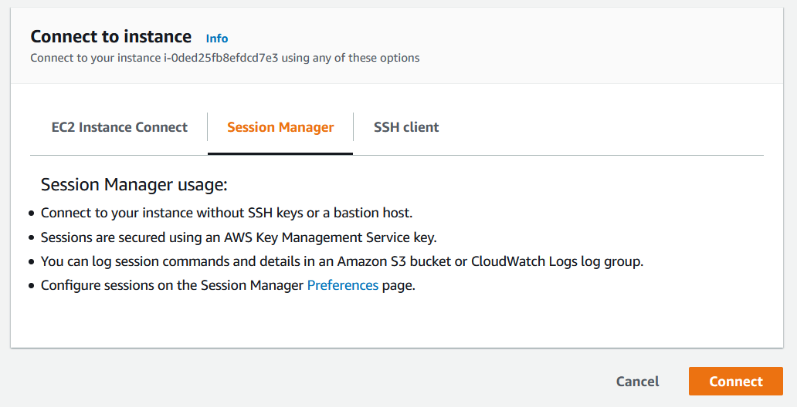


**Warning :** if you have a wrong configuration (bad network configuration, or the SSM IAM role is missing on the instance), you should have the following screen. Contact the team, to help you.

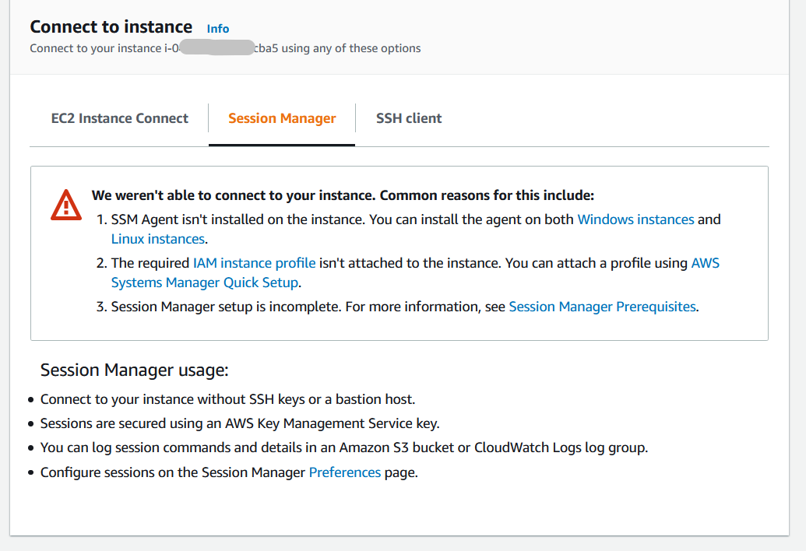


 **Step 57 :** If everything is fine, you should have access to the console. If you want to use a basic bash environment with the default user "ec2-user", you just need to type : 

```
sudo su - ec2-user
```

 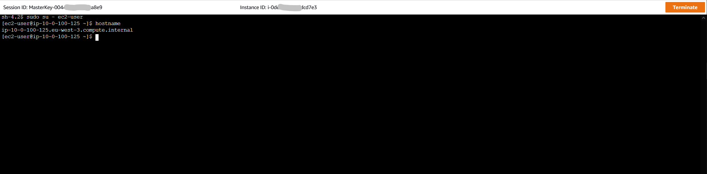

### 2.1.2 Ping and Web test


If everything is fine, you should be run all those tests

For a ping : 

```
ping <destination ip>
```

For a web test : Internet browser or a curl

```
curl http://<destination ip>
```


Test table : 

|             | Source                   | Destination                              | Protocol | Result |
| :---------: | ------------------------ | ---------------------------------------- | -------- | ------ |
| **Step 58** | EC2 - Private Subnet AZa | EC2 - Public Subnet AZa (10.1.0.0/24)    | ping     |        |
| **Step 59** | EC2 - Private Subnet AZb | EC2 - Public Subnet AZb (10.2.0.0/24)    | ping     |        |
| **Step 60** | EC2 - Private Subnet AZa | EC2 - Private Subnet AZb (10.200.0.0/24) | ping     |        |
| **Step 61** | EC2 - Public Subnet AZa  | EC2 - Public Subnet AZb (10.1.0.0/24)    | ping     |        |
| **Step 62** | EC2 - Private Subnet AZa | www.amazon.fr                            | ping     |        |
| **Step 63** | EC2 - Private Subnet AZb | www.amazon.fr                            | ping     |        |
| **Step 64** | EC2 - Public Subnet AZa  | www.amazon.fr                            | ping     |        |
| **Step 65** | EC2 - Public Subnet AZb  | www.amazon.fr                            | ping     |        |
| **Step 66** | Your computer            | EC2 - Public Subnet AZa (Public IP)      | ping     |        |
| **Step 67** | Your computer            | EC2 - Public Subnet AZb (Public IP)      | ping     |        |
| **Step 68** | Your computer            | EC2 - Public Subnet AZa (Public IP)      | http     |        |
| **Step 69** | Your computer            | EC2 - Public Subnet AZb (Public IP)      | http     |        |

