# **Lab VPC Peering**
In this lab you will setup a VPC peering allowing on EC2 instance from each VPC to communicate with the other

## 1. Deploy the Lab environment

We have prepared a Cloud Formation template that will create the following environment:

 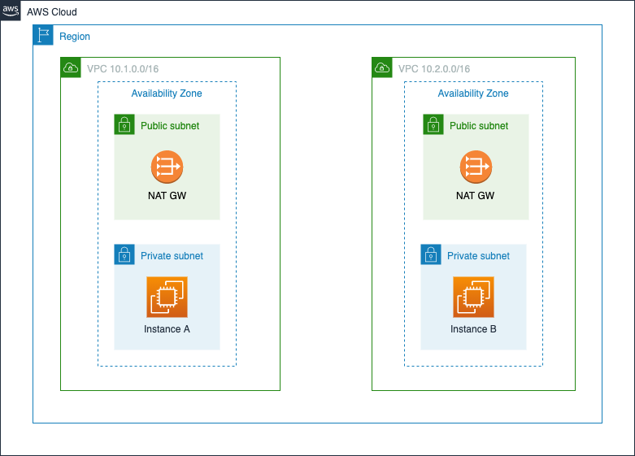

Each instance is deployed in its own VPC on a private subnet inside an Availability Zone. NAT Gateways will be available in each VPC allowing instances in the Private Subnet to access the Internet. Note that **no** SSH keys and **no** public IPs are required since we'll use **AWS SSM Session Manager** to interactively connect to both instances.

### **1.1 Deploy the Cloud Formation** 

 **Tip:** the AWS Console is available in **french**, we’ll use the AWS Console in **english**, all screenshots will be from the english version.

**Step 1 :**  To change from french to english, go to **bottom** **left** of the AWS Console and select english. (Note the lab will of course work in french!)

 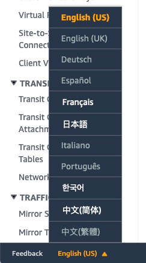 


**Step 2 :** In the AWS Console, make sure you’re using the **EU (Paris)** Region. Your browser may have been directed to another Region depending on your IP address and/or HTTP Proxy.

**Step 3 :**  In the AWS Console click on Services on the top left of you console:

  

**Step 4 :**  In the textbox under "All Services", write "CloudFormation" and select the service:

 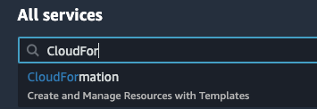 

**Step 5 :**  On the top right of you screen, click on the "**Create New Stack**" button then select "**With new resources (standard)**"
 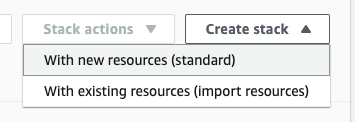 

**Step 6 :**  Select "**Template is ready**"and "Upload a template file":

 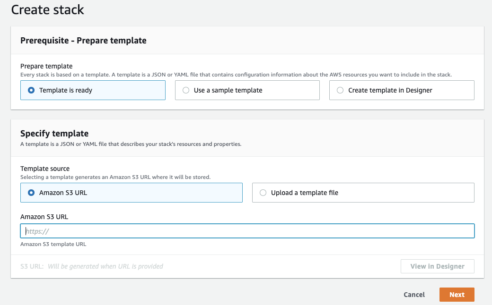

**Step 7 :** Download the [CloudFormation template here](https://raw.githubusercontent.com/aws-samples/flex-net-france/main/immersionday2021/LAB2_VPCAdv/VPCPeeringLab-stack.template.json)

**Step 8 :** And select the downloaded file *VPCPeeringLab-stack.template.json*

**Step 9 :** Then click "**Next**" button.

**Step 10 :** Enter the **Stack Name** of you choice, then click **Next**

**Step 11 :** Don’t modify the **Parameters** value.

 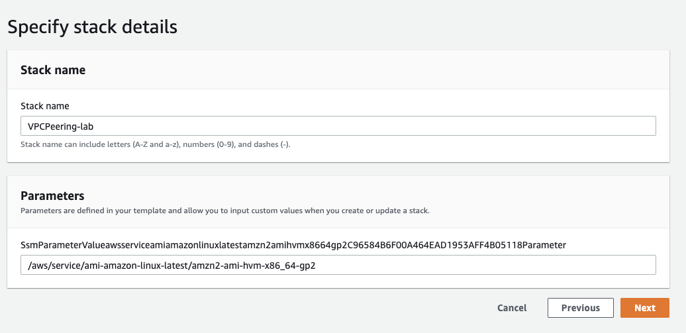


**Step 12 :** In the next page, leave all options as default then click Next again

**Step 13 :** Acknowledge that CloudFormation will be authorized to create IAM resources and click "**Create Stack**"


 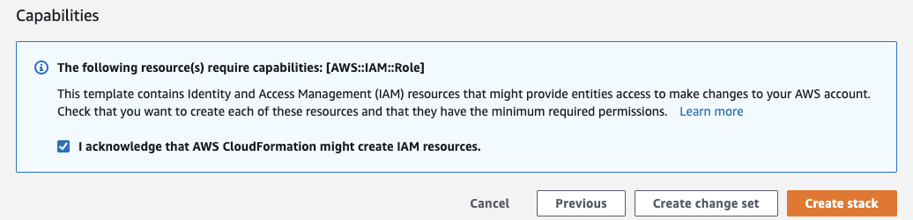

**Step 14 :** At this point your stack should appear in a "**CREATE_IN_PROGRESS**" status
 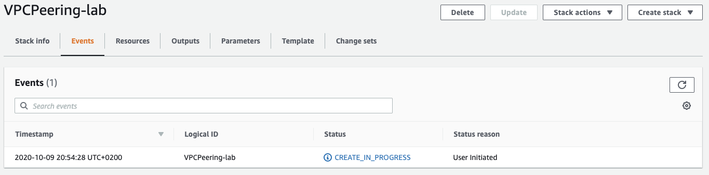

**Step 15 :** The creation process will take around **five** **minutes**, you can click on the refresh button on the top right side to check the resources creation process. You'll see that the stack creation is complete on the left pane.


 As long as CREATE_IN_PROGRESS is displayed, don’t move to the next step yet.

 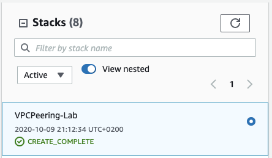 

**Step 16 :** Once the stack is created and in CREATE_COMPLETE status, use the Services top menu to navigate to the EC2 service

 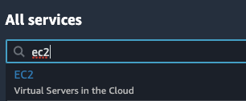 


 **Step 17 :** From the left pane select "**Instances**"

 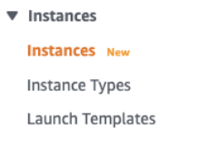
 
 You should be able to see two EC2 instances created by CloudFormation

 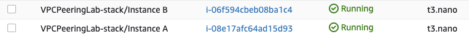 


**Step 18 :**  If an EC2 instance is still **Initializing**, wait and refresh the window until it’s “Running”


  
 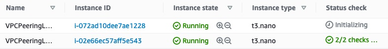


## **2. Connectivity check**

**Step 19 :** Select Instance B by clicking the check box on the left side of its name then scroll down and make note of its IPv4 address:
 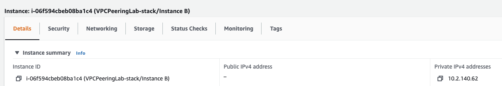


*Note you’ll notice a warning screen:*
 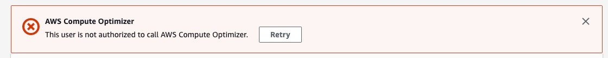

*This is due to permissions being restricted using IAM (Identity and Access Management) for public workshops. Restrictions are good practices AWS recommends (see https://aws.amazon.com/fr/architecture/well-architected/ for more)*


**Step 20 :**  Unselect Instance B checkbox then select Instance A by clicking the check box on the left side of its name then from the top right menu click on "**Actions**" then select "**Connect**"


 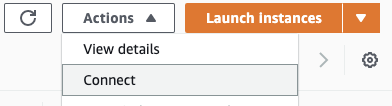 


**Step 21 :**  On the next screen select **Session Manager** then click **Connect**


 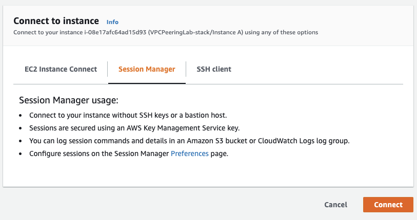


**Step 22 :** This should open a Terminal in a new browser tab.


**Step 23 :**  First let's check that the instance can access the Internet through the NAT Gateway. For example we can try to run a yum update command:

```
 sudo yum update
```


 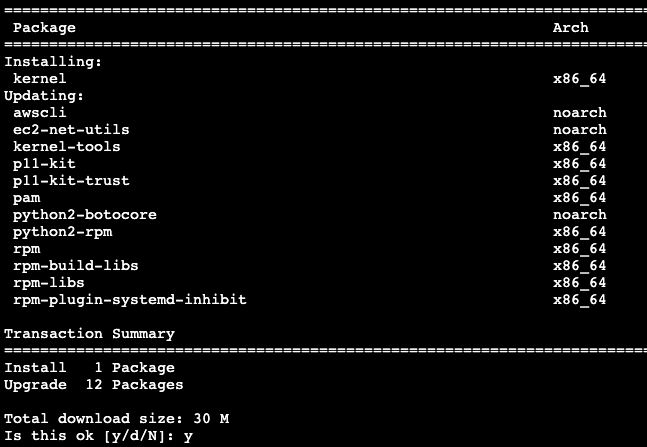 


**Step 24 :**  Now that we've confirmed our connectivity with the Internet, let's display our ip address and confirm that we're in a VPC A Subnet:

```
ip a show eth0
```

**Step 25 :**  Then let's try to ping the instance in the other VPC

```
ping -c 5 -W 1 <instance B IPv4 address> 
```

 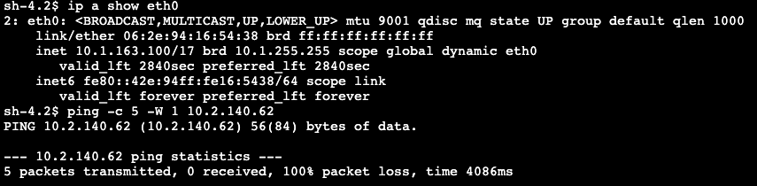


As expected, it doesn't work. For the instance A to be able to reach instance B in another VPC we need to setup a VPC peering.

## 3. Setup the VPC Peering


**Step 26 :** Use the Services menu to navigate to the VPC service

 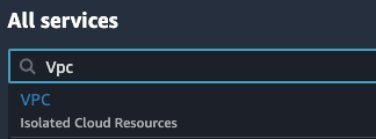 


**Step 27 :**  From the Virtual Private Cloud category select "**Peering Connections**"
 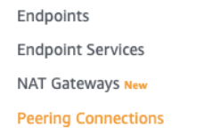 

**Step 28 :**  Click on the "Create Peering Connection" button:
 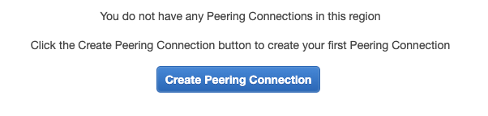 

**Step 29 :**  As the Requester, select the **VPC-10.1.0.0—16** VPC:

 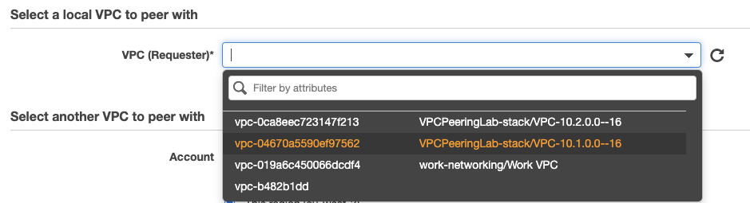


**Step 30 :** As the Accepter, select the **VPC-10.2.0.0—16** VPC in the same account and same region

 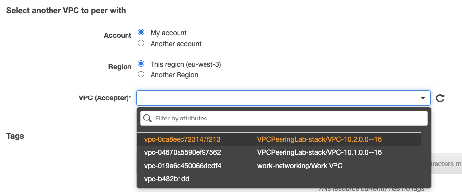


**Step 31 :** Click on the "**Create Peering Connection**" Button at the bottom right.


**Step 32 :** If the peering request has successfully been created you should see a screen similar to the following:

 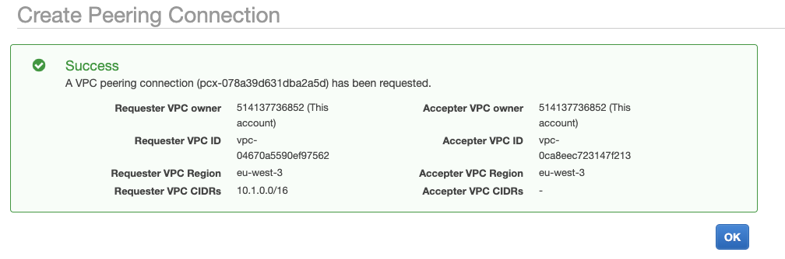

**Step 33 :** At this point when clicking "**Ok**" you should see the peering connection in a "**Pending Acceptance**" status:


 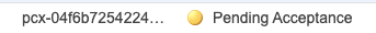 
 From the top menu, click on "Action" then select "Accept Request"
 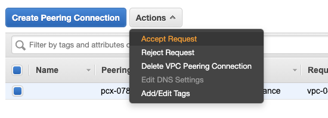 

**Step 34 :**  Finally, confirm the Acceptation:


 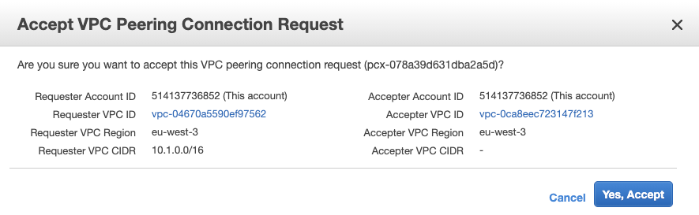


 We are almost done, at this point the last thing that remains to be done is to update the routing tables. 

**Step 35 :**After clicking the "Yes, Accept" button, the interface invites you to modify them by clicking the provided link:


 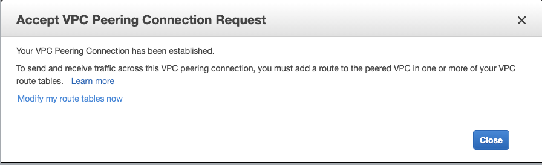


**Step 36 :** If you missed it, don't worry, simply go back to the VPC service and from the left pane select "Route Tables in the Virtual Private Cloud" group:

 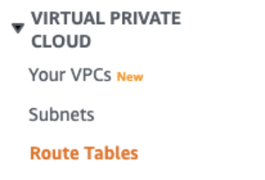 


## 4. Updating the Route Tables with the VPC Peering


**Step 37 :** Select the route table of the **VPC-10.1.0.0--16/PrivateSubnet1** by clicking the check box on the left side of its name:


 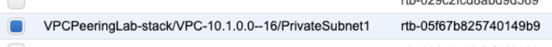


Note: Make sure to select the **Private** subnet, not the Public one.

**Step 38 :**  Then from the top menu click "**Actions**" and select "**Edit Routes**":


 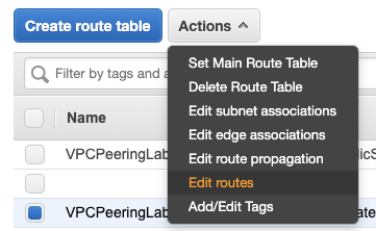 

 

**Step 39 :** Make sure to “**Add Route**”, leave the first two lines.

**Step 40 :**  In the destination field, insert the CIDR of VPC-10.2.0.0—16, in the target dropbox select "**Peering Connection**" then click on the only available entry.
 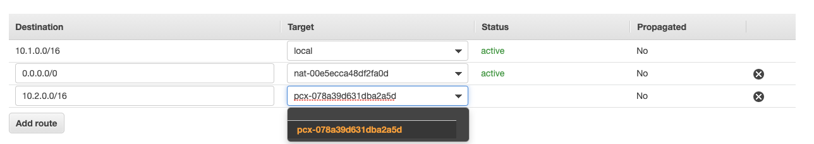

**Step 41 :** Click "Save Routes"

**Step 42 :** Perform the same operation with the VPC-10.2.0.0—16 routing table but this time add the VPC-10.1.0.0-16 CIDR as destination:

**Step 43 :** Now Connect again to the instance A in VPC-10.1.0.0—16 using the SSM session and try again to ping the instance B in VPC-10.2.0.0—16:


 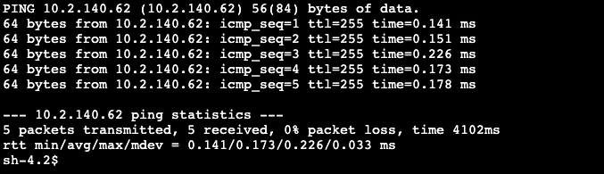 

**Step 44 :**  Congratulations, you have successfully setup a VPC peering ! The initial environment now looks as follows:

 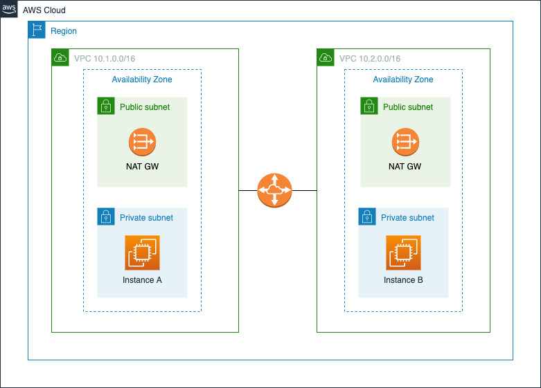


## 5. Bonus track - Do it with an AWS Transit Gateway


